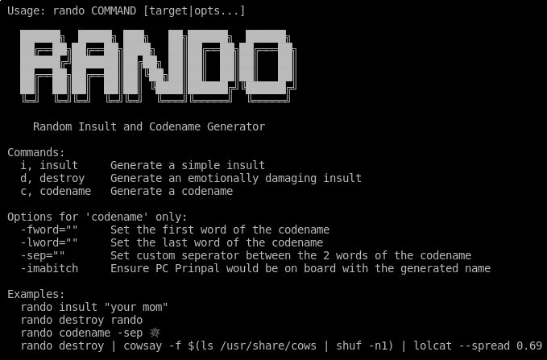
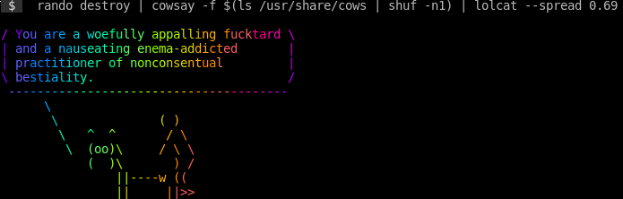

# rando - Random Insult and Codename Generator



This project was initially started as a means to make our slackbot at work a bit more interesting. It's design was heavily influenced by the glorious [Better Off Ted](https://www.youtube.com/watch?v=Bh7Nz4bIwss) episode in which they develop an ingenious Insult Formula.

It was quickly realized that there were many more useful applications for rando, such as:

- Making users feel bad about themselves when mistyping their passwords
- Enhancing boring errors by humilating the function that caused the error
- Populating DB values like addedby/createdby with funny offensive codenames
- etc...

It can be used as command-line tool or imported as a library in other projects. Some illustrative examples are provided down yonder...

---

## Install

`$> go get github.com/traviscampbell/rando/...`

---

## CLI Usage Examples

__Basic Insult:__ `rando i, insult [name]`

Just a simple, succinct, top-shelf insult that goes well with any occasion.

```shell
$> rando i
You are a filthy reprehensible douchebag.

$> rando insult rando
Rando is a dreadfully toxic cuck.

$> rando insult "your mom"
Your Mom is a horribly incompetent thundercunt.
```

__Emotionally Crippling Insult:__ `rando d, destory [name]`

This generates a powerful compound insult that is then topped-off with finisher that is sure to cut the target to their core, keeping them awake at night reflecting on just how accurate the statement truly was.

TODO: Scrape social media/financial accts of the target to deeply personalize the insult ensuring maximum effect.

```shell
$> rando d
You are a ridiculously reprehensible fucknugget and a dense cocksucking shithead whose birth certificate is an apology from the condom factory.

$> rando destroy rando
Rando is an absurdly dense shitstain, and a parasitic soul-destroying cesspool of sub-human filth.
```

__Codename Generation:__ `rando c, codename [opts]`

You can use the `-fword` or `-lword` flag to specifically set the first or last word (thanks @jakewarren).
The `-sep` flag can be used to set a custom seperator between the two words of the codename.
Lastly, if you want name that's probably not offensive all you gotta do is admit that you are a little bitch with the `-imabitch` flag.

```shell
$> rando codename
CretinousFucknugget

$> rando c -fword fappy
FappyScrotum

$> rando codename -sep 💥
Sinister💥Schlong

$> rando c -imabitch
LoudPanda
```

---

## Library Usage Example

```go
package main

import (
    "fmt"
    "strconv"

    "github.com/traviscampbell/rando"
) 

func main() {
    // submiting an empty string to insult or destroy
    // will default the insult to the prefix "You are"
    fmt.Println(rando.Insult(""))
    fmt.Println(rando.Destoy(""))

    // enhanced error example
    if _, err := Swaffelen(); err != nil {
        fmt.Println(err)
    }

    // codename's can also make useful descriptions...
    fmt.Println("I heard you're a straight up", rando.Codename().WithSeperator(" "))
    fmt.Println("Wasn't sure at first, but now I can totally see that now!")
}

// Swaffelen - Dutch term for repeatedly hitting one's penis against
// an object or another person's body, typically their face. ⊙▃⊙
func Swaffelen() error {
    if _, err := strconv.Atoi("𓂸"); err != nil {
        // enhance error by shaming the Swaffelen function for its failure
        return fmt.Errorf("[!] %s - %s", rando.Insult("Swaffelen"), err.Error())
    }
    return nil
}
```

---

Keep your self-esteem in check by adding pretty self-affirmations to your `.bashrc` file:

```shell
$> rando destroy | cowsay -f $(ls /usr/share/cows | shuf -n1) | lolcat --spread 0.69
```


