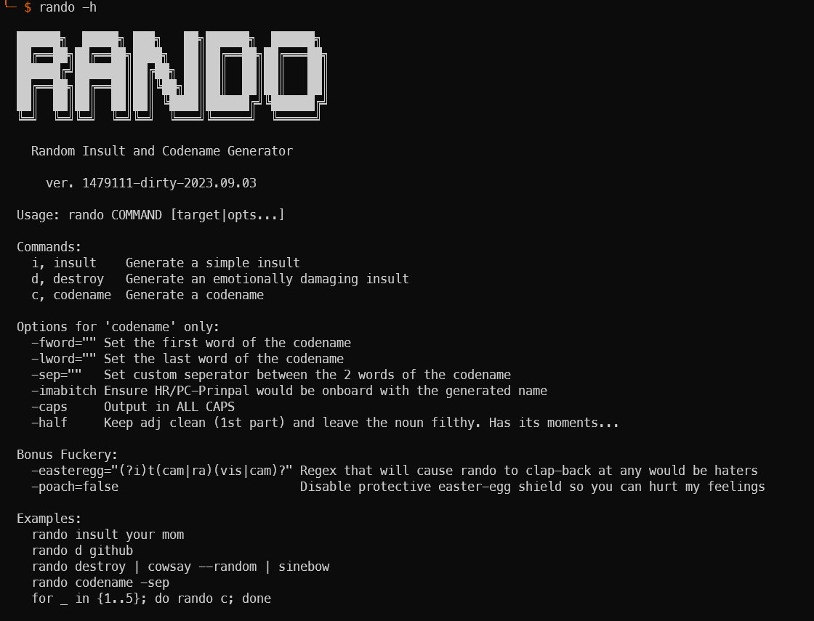

# rando - Random Insult and Codename Generator

[](http://godoc.org/github.com/traviscampbell/rando)
[](/LICENSE.md)

This project was initially started as a means to make our slackbot at work a bit more interesting. It's design was heavily influenced by the glorious [Better Off Ted](https://www.youtube.com/watch?v=Bh7Nz4bIwss) episode in which they develop an ingenious Insult Formula.

It was quickly realized that there were many more useful applications for `rando`, such as:

- Making users feel bad about themselves when mistyping their passwords
- Enrich boring errors by humilating the function that caused the error
- Populating DB values like addedby/createdby with funny offensive codenames
- Piping generated insults into `espeak` or `say` when clients are nearby
- Helping new hires develop tougher skin, and self-esteem issues, etc...

It can be used as command-line tool or imported as a library in other projects. Some example usage is provided down yonder...

## Install

**Source**

```shell
» go install github.com/traviscampbell/rando/cmd/rando@latest
```

or if just wanting to include as a library

```
 » get get -u github.com/traviscampbell/rando
```

**Binaries**

[](https://github.com/traviscampbell/rando/releases)

## Usage & Examples




### Basic Insult

`rando i, insult <target>`

Just a simple, succinct, top-shelf insult that goes well with any occasion.

```shell
» rando i
You are a filthy reprehensible douchebag.

» rando insult rando
Rando is a dreadfully toxic cuck.

» rando insult your mom
Your Mom is a horribly incompetent thundercunt.
```

### Emotionally Crippling Insult

`rando d, destroy <target>`

This generates a powerful compound insult that is then topped-off with finisher that is sure to cut the target to their core, keeping them awake at night reflecting on just how accurate the statement truly was.

```shell
» rando d
You are an extremely inept queef and a depraved disease-ridden dickhole who should slip into something more comfortable... like a coma.

» rando destroy rando
Rando is an annoyingly toxic shitter and a depraved piss-drinking tryhard whose existence is meaningless and only brings pain and suffering to those around them.
```

### Codename Generation
`rando c, codename [opts]`

- `-fword`: specifically set the first word of the codename (thanks @jakewarren)
- `-lword`: specifically set the second word of the codename (thanks @jakewarren)
- `-sep`: set a custom seperator between the codename words
- `-imabitch`: just admit you are a little bitch and it'll give you a clean pc safe-space friendly name

```shell
» rando codename
CretinousFucknugget

» rando c -fword fappy
FappyScrotum

» rando codename -sep 💥
Sinister💥Schlong

» rando c -imabitch
LoudPanda
```

### Library Usage Example

```go
package main

import (
    "fmt"

    "github.com/traviscampbell/rando"
)

func main() {
    // submiting an empty string to insult or destroy
    // will default the insult to the prefix "You are"
    fmt.Println(rando.Insult(""))
    fmt.Println(rando.Destoy(""))

    // bitch, I dare you. ☜(꒡⌓꒡)
    fmt.Println(rando.Destroy("travis"))

    // (ﾉ☉ヮ⚆)ﾉ ⌒*:･ﾟ✧ codenames
    cn := rando.Codenamer()
    fmt.Println(cn.Generate())
    fmt.Println(cn.WithSep("💥").Generate())

    // make sure embarrass and belittle functions if/when they err
    if err := mumpsimus(); err != nil {
        fmt.Println(rando.Destroy("mumpsimus"), " - ", err)
    }
}

func mumpsimus() error {
    return fmt.Error("i knew better, but didn't care")
}
```

### Bonus

Keep your self-esteem in check by adding gentle self-affirmations to your `~/.bashrc` file:

```shell
# gocat attempts to colorize at least something in any text stream
# ref: github.com/traviscampbell/gocat
» rando destroy | cowsay --random | gocat
```


### (V) (°,,,,°) (V) why not give a shit?

<a href="https://www.buymeacoffee.com/traviscampbell" target="_blank"></a>
